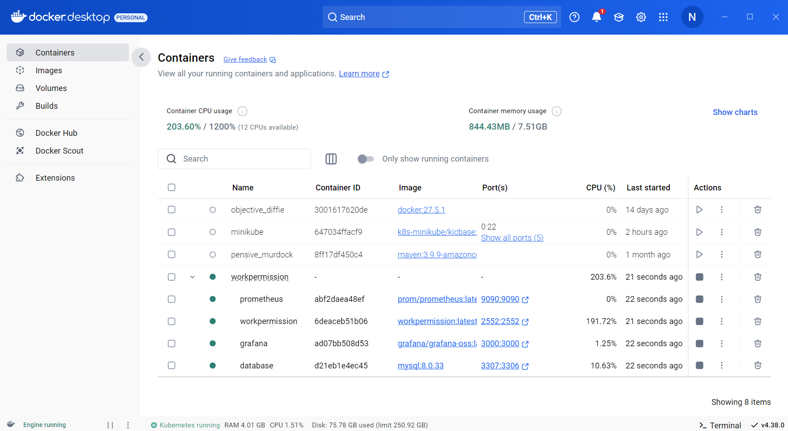

# Case Study - Work Permission

<p align="center">
    
</p>

### 📖 Information

<ul style="list-style-type:disc">
   <li>
      <b>Annual Paid Leave Policy:</b>
      <ul>
         <li>
            To be eligible for annual paid leave, an employee must have worked at least one year in our company. Each year, employees earn leave days based on their length of service, as shown in the table below:
            <br><br>
            <table>
               <thead>
                  <tr>
                     <th>Length of Service</th>
                     <th>Annual Leave (Business Days/Year)</th>
                  </tr>
               </thead>
               <tbody>
                  <tr>
                     <td>From 1 year up to (and including) 5 years</td>
                     <td>15</td>
                  </tr>
                  <tr>
                     <td>More than 5 years up to (and including) 10 years</td>
                     <td>18</td>
                  </tr>
                  <tr>
                     <td>More than 10 years</td>
                     <td>24</td>
                  </tr>
               </tbody>
            </table>
         </li>
         <li>
            Weekends (Saturday, Sunday) and official holidays do <b>not</b> count towards leave days.
         </li>
         <li>
            New hires can use <b>up to 5 business days</b> as advanced leave during their first year. This applies <b>only</b> to the first year of employment.
         </li>
         <li>
            When a future-dated leave request is submitted, the requested days are deducted from the employee’s <b>available</b> leave balance.
         </li>
         <li>
            Employees <b>cannot</b> request more leave than their remaining leave balance.
         </li>
         <li>
            When a leave request is created, it is initially in the <b>“Pending Approval”</b> status. After managerial review, it is either <b>“Approved”</b> or <b>“Rejected.”</b>
         </li>
      </ul>
   </li>
</ul>


### Explore Rest APIs

Endpoints Summary
<table style="width:100%;">
    <tr>
        <th>Method</th>
        <th>Url</th>
        <th>Description</th>
        <th>Request Body</th>
        <th>Path Variable</th>
        <th>Response</th>
    </tr>
    <tr>
        <td>POST</td>
        <td>/api/v1/authentication/user/register</td>
        <td>Register for Admin or User</td>
        <td>RegisterRequest</td>
        <td></td>
        <td>CustomResponse&lt;Void&gt;</td>
    </tr>
    <tr>
        <td>POST</td>
        <td>/api/v1/authentication/user/login</td>
        <td>Login for Admin or User</td>
        <td>LoginRequest</td>
        <td></td>
        <td>CustomResponse&lt;TokenResponse&gt;</td>
    </tr>
    <tr>
        <td>POST</td>
        <td>/api/v1/authentication/user/refresh-token</td>
        <td>Refresh Token for Admin or User</td>
        <td>TokenRefreshRequest</td>
        <td></td>
        <td>CustomResponse&lt;TokenResponse&gt;</td>
    </tr>
    <tr>
        <td>POST</td>
        <td>/api/v1/authentication/user/logout</td>
        <td>Logout for Admin or User</td>
        <td>TokenInvalidateRequest</td>
        <td></td>
        <td>CustomResponse&lt;Void&gt;</td>
    </tr>
    <tr>
        <td>POST</td>
        <td>/api/v1/leaverequests</td>
        <td>Create a new leave request</td>
        <td>CreateLeaveRequest</td>
        <td>-</td>
        <td>CustomResponse&lt;LeaveRequestResponse&gt;</td>
    </tr>
    <tr>
        <td>GET</td>
        <td>/api/v1/leaverequests/{id}</td>
        <td>Retrieve leave request by ID</td>
        <td>-</td>
        <td>id (UUID)</td>
        <td>CustomResponse&lt;LeaveRequestResponse&gt;</td>
    </tr>
    <tr>
        <td>GET</td>
        <td>/api/v1/leaverequests/users/{userId}</td>
        <td>Retrieve paginated leave requests for a user</td>
        <td>LeaveRequestPagingRequest</td>
        <td>userId</td>
        <td>CustomResponse&lt;CustomPagingResponse&lt;LeaveRequestResponse&gt;&gt;</td>
    </tr>
    <tr>
        <td>PATCH</td>
        <td>/api/v1/leaverequests/{leaveRequestId}/status</td>
        <td>Update the status of a leave request</td>
        <td>Query Parameter: status (LeaveStatus)</td>
        <td>leaveRequestId</td>
        <td>CustomResponse&lt;LeaveRequestResponse&gt;</td>
    </tr>
    <tr>
        <td>GET</td>
        <td>/api/v1/leaverequests/remaining/{userId}</td>
        <td>Retrieve remaining leave days for a user</td>
        <td>-</td>
        <td>userId (UUID)</td>
        <td>CustomResponse&lt;Long&gt;</td>
    </tr>
</table>


### Technologies

---
- Java 21
- Spring Boot 3.0
- Restful API
- Open Api (Swagger)
- Maven
- Junit5
- Mockito
- Integration Tests
- Docker
- Docker Compose
- CI/CD (Github Actions)
- Postman
- Prometheus
- Grafana
- Kubernetes
- JaCoCo (Test Report)

### Postman

```
Import postman collection under postman_collection folder
```


### Prerequisites

#### Define Variable in .env file

```
WORK_PERMISSION_DB_IP=localhost
WORK_PERMISSION_DB_PORT=3306
DATABASE_USERNAME={MY_SQL_DATABASE_USERNAME}
DATABASE_PASSWORD={MY_SQL_DATABASE_PASSWORD}
```

### Open Api (Swagger)

```
http://localhost:2552/swagger-ui/index.html
```

---

### JaCoCo (Test Report)

After the command named `mvn clean install` completes, the JaCoCo report will be available at:
```
target/site/jacoco/index.html
```
Navigate to the `target/site/jacoco/` directory.

Open the `index.html` file in your browser to view the detailed coverage report.

---

### Maven, Docker and Kubernetes Running Process


### Maven Run
To build and run the application with `Maven`, please follow the directions shown below;

```sh
$ cd pdfcompare
$ mvn clean install
$ mvn spring-boot:run
```

---

### Docker Run
The application can be built and run by the `Docker` engine. The `Dockerfile` has multistage build, so you do not need to build and run separately.

Please follow directions shown below in order to build and run the application with Docker Compose file;

```sh
$ cd pdfcompare
$ docker-compose up -d
```

If you change anything in the project and run it on Docker, you can also use this command shown below

```sh
$ cd pdfcompare
$ docker-compose up --build
```

To monitor the application, you can use the following tools:

- **Prometheus**:  
  Open in your browser at [http://localhost:9090](http://localhost:9090)  
  Prometheus collects and stores application metrics.

  Alert is alrealdy defined in Alert tab


- **Grafana**:  
  Open in your browser at [http://localhost:3000](http://localhost:3000)  
  Grafana provides a dashboard for visualizing the metrics.  
  **Default credentials**:
    - Username: `admin`
    - Password: `admin`


- Define prometheus data source url, use this link shown below

```
http://prometheus:9090
```

---


### Kubernetes Run
To build and run the application with `Maven`, please follow the directions shown below;

- Start Minikube

```sh
$ minikube start
```

- Open Minikube Dashboard

```sh
$ minikube dashboard
```

- To deploy the application on Kubernetes, apply the Kubernetes configuration file underneath k8s folder

```sh
$ kubectl apply -f k8s
```

- To open Prometheus, click tunnel url link provided by the command shown below to reach out Prometheus

```sh
minikube service prometheus-service
```

- To open Grafana, click tunnel url link provided by the command shown below to reach out Prometheus

```sh
minikube service grafana-service
```

- Define prometheus data source url, use this link shown below

```
http://prometheus-service.default.svc.cluster.local:9090
```

---
### Docker Image Location

```
https://hub.docker.com/repository/docker/noyandocker/workpermission/general
```

### Screenshots

<details>
<summary>Click here to show the screenshots of project</summary>
    <p> Figure 1 </p>
    
    <p> Figure 2 </p>
    
    <p> Figure 3 </p>
    
    <p> Figure 4 </p>
    
    <p> Figure 5 </p>
    
    <p> Figure 6 </p>
    
    <p> Figure 7 </p>
    
    <p> Figure 8 </p>
    
    <p> Figure 9 </p>
    
    <p> Figure 10 </p>
    
    <p> Figure 11 </p>
    
    <p> Figure 12 </p>
    
    <p> Figure 13 </p>
    
    <p> Figure 14 </p>
    
    <p> Figure 15 </p>
    
    <p> Figure 16 </p>
    
    <p> Figure 17 </p>
    
    <p> Figure 18 </p>
    
    <p> Figure 19 </p>
    
    <p> Figure 20 </p>
    
</details>


### Contributors

- [Sercan Noyan Germiyanoğlu](https://github.com/Rapter1990)